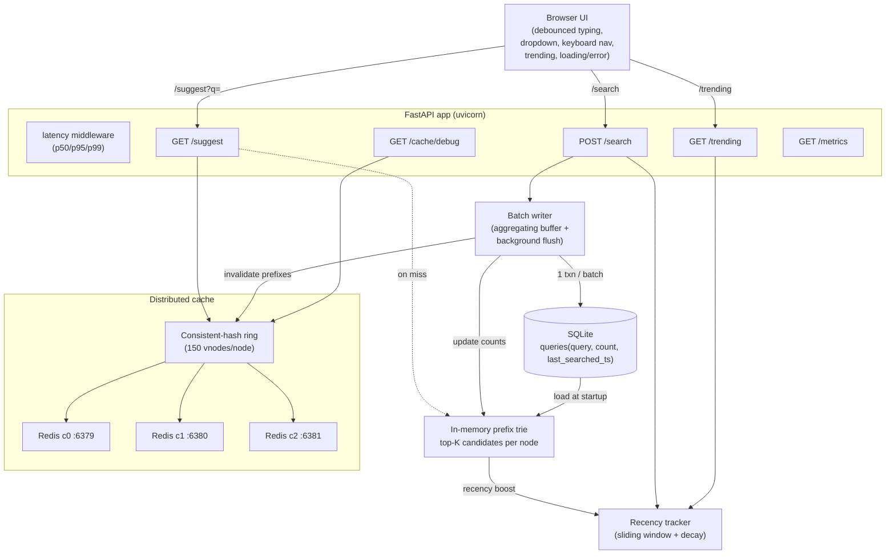

# Search Typeahead System: Project Report

**Author:** praneethb7 · **SST Roll Number:** 24bcs10081
**Course:** High Level Design 101 / SST
**Date:** 2026-06-22

---

## 0. Executive summary

This project implements a **search-as-you-type suggestion system** — the autocomplete you see in search engines and e-commerce sites. As the user types a prefix, the system returns up to **10** popular query suggestions with low latency; submitted searches are recorded and feed back into popularity rankings. The workload is deliberately **read-heavy** (many suggestion lookups, comparatively few search submissions), so the design optimises the read path hard and relaxes the write path. Reads are served from a **distributed cache of 3 Redis nodes**, where the owning node for each prefix key is chosen by a **consistent-hash ring** (150 virtual nodes per physical node). On a cache miss, an **in-memory prefix trie** answers the prefix in `O(len(prefix))` because every trie node caches a precomputed top-K candidate list. Writes never touch the database synchronously: each `POST /search` is recorded in an in-memory **recency tracker** (so trending updates instantly) and enqueued into a **batch writer** that aggregates repeated queries and flushes the whole buffer to **SQLite** in a single transaction. Measured on an actual run, this yields **~97% fewer row-writes** — 3,000 search submissions became 80 row-writes across just 4 DB commits — and a **~99% cache hit rate** (5,941 / 6,000 lookups) on repetitive typeahead traffic, with server-side suggestion latency at p50 ≈ 1.0 ms / p99 ≈ 2.2 ms.

The system is intentionally built to exercise the High Level Design (HLD) syllabus: consistent hashing, distributed caching, eviction & invalidation, CAP/PACELC, replication vs sharding, SQL vs NoSQL/LSM internals, and microservice-style API design.

### Rubric coverage

| Graded component | Points | Where implemented | Primary evidence |
|---|---|---|---|
| **Basic implementation** (typeahead, ranking, distributed cache + consistent hashing, SQLite store, API) | 60 | `backend/cache/ring.py`, `backend/cache/cache.py`, `backend/index/trie.py`, `backend/index/ranking.py`, `backend/services/suggest_service.py`, `backend/store/db.py`, `backend/main.py` | `GET /suggest` returns ranked prefix matches; `GET /cache/debug` proves consistent-hash routing across 3 nodes; §1, §3, §4 |
| **Trending searches** (recency-aware ranking + `/trending`) | 20 | `backend/services/trending.py`, `backend/index/ranking.py` (`rank_recency`), `backend/services/search_service.py` | Sliding-window buckets + exponential half-life decay; additive boost `score = count + 8.0 × recent`; `GET /trending`; §3, §4.6 |
| **Batch writes** (buffer + single-transaction flush, write reduction) | 20 | `backend/services/batch_writer.py`, `backend/store/db.py` (`batch_upsert`) | `/metrics.batch.estimated_write_reduction ≈ 0.97` (measured); N searches → 1 commit per batch; §4.5, §5.4 |

---

## 1. Architecture

### 1.1 Diagram (portable ASCII)

The following diagram renders in any Markdown → PDF converter (no JavaScript or Mermaid required).

```
                          +------------------------------------------+
                          |              Browser UI                  |
                          |  debounced typing - dropdown - keyboard  |
                          |  nav - trending panel - recency toggle   |
                          +---------------+--------------------------+
                                          |  HTTP (same origin, no CORS)
       GET /suggest?q= | POST /search | GET /trending | GET /cache/debug | GET /metrics
                                          |
            +-----------------------------v----------------------------------+
            |                      FastAPI app (uvicorn)                      |
            |  timing middleware -> records p50/p95/p99 per path,             |
            |                       sets X-Process-Time-Ms, Cache-Control     |
            |  +--------------+  +-------------+  +--------------+             |
            |  |SuggestionSvc |  | SearchSvc   |  | /trending    |            |
            |  +------+-------+  +------+------+  +------+--------+            |
            +---------+-----------------+----------------+--------------------+
                      | (read path)     | (write path)   |
                      v                 |                 v
        +---------------------------+   |        +--------------------------+
        |  Consistent-hash ring     |   |        |  Recency tracker         |
        |  MD5 128-bit, 150 vnodes  |   |        |  sliding window of       |
        |  /node -> owning node     |   |        |  1-min buckets over 10min|
        +---+---------+---------+---+   |        |  + exponential half-life |
            |         |         |       |        +--------------------------+
            v         v         v       |
        +------+  +------+  +------+     |
        |Redis |  |Redis |  |Redis |    |   (search records recency FIRST,
        | c0   |  | c1   |  | c2   |    |    then enqueues a +1 increment)
        |:6379 |  |:6380 |  |:6381 |    |
        |64mb  |  |64mb  |  |64mb  |    v
        |LRU   |  |LRU   |  |LRU   |  +--------------------------------------+
        +------+  +------+  +------+  |  Batch writer                        |
            |  cache MISS             |  in-memory dict buffer               |
            v                         |  query -> pending_count              |
        +--------------------------+  |  flush trigger: >=500 distinct       |
        |  In-memory prefix trie   |  |  queries OR >=2.0s (whichever first) |
        |  every node caches a     |  +------+----------------+--------------+
        |  precomputed top-K (50)  |         | 1 txn / batch  | update counts
        |  candidate list          |<--------+----------------+ (promote-along-path)
        |  O(len(prefix)) lookup   |         |
        +----------+---------------+         v
                   | rebuilt at    +--------------------------------------+
                   | startup       |  SQLite (primary store / source of   |
                   +-------------->|  truth)                              |
                                   |  queries(query PK, count,            |
                                   |          last_searched_ts)           |
                                   |  WAL journal - synchronous=NORMAL    |
                                   +--------------------------------------+
       Batch writer also calls cache.invalidate_for_queries(changed) -> drops
       affected prefix keys on the ring so the next read recomputes fresh rankings.
```

### 1.2 Diagram (Mermaid, optional)

For viewers that render Mermaid, the same topology (reproduced from `docs/HLD.md`):



### 1.3 Components

| Component | File(s) | Responsibility |
|---|---|---|
| **Browser UI** | `frontend/index.html`, `styles.css`, `app.js` | Debounced typeahead, dropdown, keyboard navigation, trending panel, recency toggle, loading/error states. Served by FastAPI from the same origin (no CORS). |
| **FastAPI app** | `backend/main.py` | Constructs all singletons, wires them via a `lifespan` context manager, exposes the HTTP routes, and times every request in a middleware. |
| **Consistent-hash ring** | `backend/cache/ring.py` | Maps each prefix key to exactly one cache node on a 128-bit MD5 circle using 150 virtual nodes per physical node. |
| **Distributed cache** | `backend/cache/cache.py` | Redis-backed suggestion cache across N nodes; cache-first reads, `SETEX` writes with TTL, targeted prefix invalidation, graceful degradation. |
| **3 Redis nodes** | `docker-compose.yml` | Three independent `redis:7-alpine` instances on ports 6379/6380/6381, each capped at 64 MB with `allkeys-lru` eviction. |
| **Prefix trie + ranking** | `backend/index/trie.py`, `ranking.py` | Read-optimised index: every node caches a top-K (=50) candidate list; ranking applies basic (count-only) or recency-aware scoring. |
| **Recency tracker** | `backend/services/trending.py` | Sliding window of fixed-size time buckets with exponential half-life decay; powers `/trending` and the recency boost. |
| **Batch writer** | `backend/services/batch_writer.py` | Aggregates per-query increments in memory and flushes them to SQLite in one transaction; updates the trie and invalidates the cache after each flush. |
| **SQLite store** | `backend/store/db.py` | Single-table source of truth `queries(query, count, last_searched_ts)`; thread-safe single connection; module-level read/write counters for the batching metric. |
| **Metrics** | `backend/metrics.py` | In-process latency percentile recorder + cache hit/miss counter; aggregated by `/metrics`. |
| **Config** | `backend/config.py` | One frozen `Settings` dataclass reading every tunable from environment variables (`.env` supported). |

### 1.4 Read (suggest) — the hot path

Implemented in `SuggestionService.suggest` (`backend/services/suggest_service.py`), called from `GET /suggest`:

1. **Normalize** the prefix via `normalize_prefix` (`raw.strip().lower()`). Empty/whitespace input short-circuits with `{"prefix": "", "suggestions": [], "source": "empty"}` — zero work.
2. **Select mode**: `trending` if `recency=true` **and** a recency tracker is present, else `basic`. (Recency silently downgrades to basic when no tracker is wired.)
3. **Cache lookup**: the consistent-hash ring (`ring.get_node(prefix)`) selects the owning Redis node; `GET suggest:{mode}:{prefix}`. On a **hit**, return immediately with `source="cache"` — the trie is never touched, and the cache records `note_cache(hit=True)`.
4. **Miss -> trie**: `index.candidates(prefix)` walks `len(prefix)` characters and returns that node's cached top-K pool (up to 50, already sorted by count descending) in `O(len(prefix))`, independent of dataset size.
5. **Rank**: `rank_basic` (an `O(limit)` slice) for basic mode, or `rank_recency` (re-scores the full pool by `count + recency_weight × recent_score`, then sorts) for trending mode.
6. **Populate cache**: `cache.set(prefix, mode, suggestions)` issues a `SETEX` with the TTL (default 30 s).
7. **Return** up to `suggest_limit` (=10) suggestions with `source="index"`. (A real prefix with no matches still returns `source="index"` with an empty list — only blank input yields `source="empty"`.)

### 1.5 Write (search) — the cold path

Implemented in `SearchService.submit` (`backend/services/search_service.py`), called from `POST /search`. It does **no synchronous DB write**:

1. **Normalize** the query (same `strip().lower()` as the read path — this shared normalisation is what makes cache keys written on suggest match queries recorded on search). Blank queries are ignored.
2. **Record recency first**: `trending.record(query)` increments the current time bucket, so `/trending` and the recency boost reflect the search **immediately** — before any DB or trie update.
3. **Enqueue** a `+1` into the batch writer's in-memory buffer (`batch_writer.record(query)`), an `O(1)` dict update under a lock.
4. **Return** `{"message": "Searched"}` right away.
5. **Asynchronously**, a background loop flushes the buffer: one SQLite UPSERT transaction (off the event loop via `asyncio.to_thread`), then it bumps the in-memory trie counts (promote-along-path) and invalidates the affected cache prefixes.

### 1.6 Data model

The single source of truth is one SQLite table:

```sql
CREATE TABLE IF NOT EXISTS queries (
    query            TEXT PRIMARY KEY,
    count            INTEGER NOT NULL DEFAULT 0,
    last_searched_ts REAL    NOT NULL DEFAULT 0
);
```

- `query` is the natural primary key (and the conceptual sharding key if scaled out).
- `count` is the all-time popularity counter; runtime writes **increment** it (`count = count + excluded.count`).
- `last_searched_ts` records the last write timestamp.

The **prefix trie** is a derived, read-optimised view rebuilt from this table at startup and kept in sync by the batch writer. **Recency state lives only in memory** (a sliding window of buckets); it is not persisted and repopulates from traffic after a restart.

---

## 2. Dataset — source & loading

### 2.1 What it is and why it is generated

The dataset is **synthesised**, not downloaded, by `scripts/generate_dataset.py`. The generator combines a bundled list of head terms with realistic aspect/tail modifiers and assigns each query a popularity `count` from a **Zipf / power-law** curve (a few queries enormously popular, a long tail rarely searched — exactly the shape of real search traffic). Three properties justify the synthetic approach:

- **Reproducible.** A fixed RNG seed (`random.Random(seed)`, default `42`) means anyone re-running gets a byte-identical dataset (as long as the bundled word lists are unchanged), so performance numbers are comparable across machines.
- **No network dependency.** The seed word lists are bundled in-file, so generation works fully offline.
- **Realistic distribution.** The Zipf model plus deterministic multiplicative jitter (`uniform(0.4, 1.6)`) breaks ties naturally and makes typeahead ranking interesting.

### 2.2 Seed terms + modifier approach

| Phase | What it produces | Count rule |
|---|---|---|
| **1. Head terms alone** | 165 head terms spanning tech/brands, programming, food/home, shopping, travel, finance, auto/health/entertainment, plus letters across the alphabet for prefix-demo coverage | classic Zipf: `count = max(int(2_000_000 / rank), 1000)` (rank-1 head = 2,000,000; floor 1000) |
| **2. Head x modifier** | cross-product of heads with 93 aspects x tails (e.g. `price`, `review`, `near me`, `best`, `online`, `today`); 558 modifier forms (no duplicates are produced, so dedupe is a no-op here) | `head_base = max(int(2_000_000 / hrank), 500)`; `count = head_base / (mrank + 1.0) × uniform(0.4, 1.6)` |
| **3. Safety top-up** | `"{head} model {version}"` variants with tiny counts | `max(int(uniform(1, 50)), 1)` — guarantees the **>=100,000** floor regardless of edits to the word lists |

`TAILS = ['', 'online', 'near me', 'best', 'cheap', 'today']`. The cross-product easily exceeds 100k rows; phase 3 only fires if the lists are trimmed below the floor.

### 2.3 Schema and a CSV example

The CSV has exactly two columns and a header, sorted by `count` descending (most popular first):

```csv
query,count
iphone,2000000
iphone price,1167312
ipad,1000000
ipad price,669581
imac,666666
```

### 2.4 Real run — what was produced

From an actual generation + ingest run:

| Metric | Value |
|---|---|
| Rows written by `generate_dataset.py` | **100,000** queries |
| Top 5 by count | `iphone` 2,000,000 - `iphone price` 1,167,312 - `ipad` 1,000,000 - `ipad price` 669,581 - `imac` 666,666 |
| Rows loaded into `data/typeahead.db` | 100,000 |
| Ingest time | ~0.3 s |

### 2.5 Loading — exact commands

**One-command path (recommended for the grader):** `./run.sh` does all of generate -> ingest -> start Redis -> launch the server automatically, skipping any step already done.

```bash
./run.sh           # bootstrap venv, generate dataset, ingest, start 3 Redis nodes, launch app
./run.sh --fresh   # rebuild the venv and regenerate the dataset from scratch
```

**Manual path (equivalent steps):**

```bash
# 1. generate the CSV (>= 100,000 queries, deterministic)
python scripts/generate_dataset.py            # writes data/queries.csv
#    optional flags: --rows 100000  --out data/queries.csv  --seed 42

# 2. load the CSV into SQLite (data/typeahead.db)
python scripts/ingest.py                       # --csv data/queries.csv
```

Ingest streams the CSV with `csv.DictReader` (the whole file is never held in memory), normalises each query to `strip().lower()`, coerces counts via `int(float(...))` (falling back to `0` on a malformed cell), and loads via `store.bulk_insert` in chunks of 5,000 rows with a single commit.

> **Write-semantics note:** ingest uses `INSERT OR REPLACE`, which **sets** counts absolutely from the CSV (idempotent re-runs replace rather than double-count). This is deliberately different from the runtime `batch_upsert`, which **increments** (`count = count + excluded.count`).

---

## 3. API documentation

Base URL: `http://localhost:8000` · Interactive Swagger docs: `http://localhost:8000/docs`.

**Global behaviour:** all text inputs are normalised server-side (`strip().lower()`), so `IP`, ` ip `, and `ip` behave identically. Empty, missing, mixed-case, and no-match inputs all return gracefully. `GET /suggest` caps results at **10** suggestions (`suggest_limit`). Every response carries `Cache-Control: no-store` and an `X-Process-Time-Ms` header (a demo convenience so UI edits always show up). Validation failures surface as FastAPI's default `422`.

### 3.1 `GET /suggest`

Up to 10 prefix-matching suggestions sorted by score.

| Param | Type | Default | Description |
|---|---|---|---|
| `q` | string | `""` | the prefix the user typed |
| `recency` | bool | `true` | `true` = recency-aware ranking; `false` = pure all-time count |

```bash
curl "http://localhost:8000/suggest?q=iph&recency=false"
```
```json
{
  "prefix": "iph",
  "source": "index",
  "suggestions": [
    {"query": "iphone", "count": 2000000, "score": 2000000.0, "recent": null},
    {"query": "iphone price", "count": 1167312, "score": 1167312.0, "recent": null},
    {"query": "iphone review", "count": 367653, "score": 367653.0, "recent": null}
  ]
}
```

- `source` is one of `cache` (served from Redis) | `index` (computed from the trie) | `empty` (blank/whitespace `q`).
- In recency mode each item also carries a numeric `recent` boost; in basic mode `recent` is `null`.
- **Edge cases:** blank `q` -> `source="empty"`, empty list. A real prefix with no matches -> `source="index"`, empty list (and that empty result is cached). A miss recomputes from the trie and populates the cache for next time.

### 3.2 `POST /search`

Submit a search. Returns the dummy response and records the query (recency + batched count).

**Body**
```json
{ "query": "iphone 15 pro" }
```
**Response**
```json
{ "message": "Searched" }
```

- The query is normalised, recorded in the recency tracker immediately, and enqueued for batched persistence — **no synchronous DB write**.
- A new query is inserted (with its accumulated count) on the next flush; an existing query's count increases. The change surfaces in `/suggest` and `/trending` after the next batch flush (<= `BATCH_INTERVAL_SECONDS`, default 2 s).
- Blank queries are ignored internally, but the endpoint still answers `{"message": "Searched"}`, so a client cannot distinguish an ignored blank submission from a recorded one via the HTTP response. `query` is required; omitting it -> `422`.

### 3.3 `GET /trending`

Currently trending queries, ranked by time-decayed recent activity.

| Param | Type | Default | Validation |
|---|---|---|---|
| `limit` | int | `10` | `1 <= limit <= 50` (out of range -> `422`) |

```json
{ "trending": [ {"query": "iphone 15 pro", "recent": 12.84}, {"query": "java tutorial", "recent": 9.1} ] }
```

- `recent` is the per-query decayed activity score, rounded to 4 decimals. Each `TrendingItem` is `{query, recent}`.

### 3.4 `GET /cache/debug`

Show which cache node owns a prefix (consistent hashing) and whether it is currently cached.

| Param | Type | Default | Notes |
|---|---|---|---|
| `prefix` | string | — (**required**) | normalised before routing; omitting -> `422` |
| `mode` | string | `basic` | `basic` \| `trending` (free-form text, not enum-validated) |

```bash
curl "http://localhost:8000/cache/debug?prefix=iph"
```
```json
{
  "prefix": "iph", "mode": "basic", "key": "suggest:basic:iph",
  "owner_node": "c1", "endpoint": "localhost:6380", "node_available": true,
  "hit": true, "ttl_seconds": 23,
  "value": [ {"query": "iphone", "count": 2000000, "score": 2000000.0} ]
}
```

- If the owning node is unreachable: the response includes `status: "unavailable"` (no `hit`/`ttl`/`value`).
- On a Redis error while reading: `status: "error: <exc>"`.

### 3.5 `GET /metrics`

Latency percentiles, cache hit rate, DB read/write counters, and batch-writer stats, composed at call time.

```json
{
  "latency": { "/suggest": {"count": 5000, "p50_ms": 1.043, "p95_ms": 1.396, "p99_ms": 2.223, "max_ms": 4.742} },
  "cache":   { "hits": 5941, "misses": 59, "lookups": 6000, "hit_rate": 0.9902 },
  "db":      { "rows_read": 100001, "rows_written": 80, "write_transactions": 4 },
  "batch":   { "submissions_received": 3000, "rows_written_via_batches": 80, "flushes": 4,
               "buffered_now": 0, "batch_max_size": 500, "batch_interval_seconds": 2.0,
               "estimated_write_reduction": 0.9733 },
  "index_size": 100006, "store_rows": 100006
}
```

- `latency` is keyed by request **path** (query strings excluded), with p50/p95/p99 computed by linear interpolation between order statistics — the same rule as NumPy's default *Type-7* method, but hand-written in `backend/metrics.py` (there is **no NumPy dependency**) — over the most recent up-to-5,000 samples per path. `latency.count` is therefore capped at 5,000 (the rolling-window size), whereas `cache.lookups` is a cumulative counter, so after a 6,000-request run the two legitimately differ.
- `cache.hit_rate` = `hits / (hits + misses)`. Note: an unreachable node or Redis error counts as a **miss**, so the hit rate is conservative under degradation.
- `db` counters isolate the batching story (see §5.7).

### 3.6 `GET /healthz`

Liveness probe. No params. Always `200`.
```json
{ "status": "ok" }
```

---

## 4. Design choices & trade-offs

### 4.1 Consistent hashing over `hash(key) % N` (+ virtual nodes)

**Syllabus:** *Load balancing & consistent hashing.* — `backend/cache/ring.py`

**Why.** Plain `hash(key) % N` remaps **almost every key** when `N` changes (add/remove a cache node), causing a *cache stampede* — every prefix suddenly misses and recomputes at once. A consistent-hash ring places both nodes and keys on a single **128-bit MD5 circle** and assigns each key to the first node clockwise; adding/removing a node only moves the keys in that node's arc — **~1/N of keys**. Lookups use `bisect` over a sorted list of ring points: `get_node` is `O(log N)` where `N = nodes × vnodes`, with explicit wrap-around (`idx == len -> 0`) for the clockwise-from-key semantics.

**Virtual nodes.** Each physical node is replicated as **150 virtual points** (label format `"{node}#{i}"`). Without vnodes, three nodes could carve the ring into three uneven arcs; with 150 points each, a sample of prefixes lands roughly evenly (~1/3 per node — see §5.5).

**Costs.** `get_node` recomputes a full MD5 per lookup (no key-hash caching). `add_node`/`remove_node` cost `O(N·V²)` element shifts — each of the `V` vnode insertions does a `bisect.insort` / `list.pop(idx)` into the `~N×V`-point ring — fine for a 3-node cluster (450 ring points) but not for a very large ring. MD5 is slower than a non-cryptographic hash (xxhash/murmur) but is well-distributed, deterministic, and in the standard library (no extra dependency); cryptographic strength is irrelevant here.

### 4.2 Prefix trie + per-node top-K + candidate-generation-then-rerank

**Syllabus:** *Caching hierarchy / read-optimised index.* — `backend/index/trie.py`, `ranking.py`

**Why.** Every trie node caches a precomputed **top-K candidate list** for its subtree, so a suggestion lookup is "walk to the node, read its cached list" — `O(len(prefix))`, **independent of the 100k-row dataset size**, instead of scanning a subtree at query time. The pool is **K = 50** rather than the ~10 displayed: basic ranking only needs the top 10 by count, but recency re-ranking re-scores the whole pool, so a currently-trending query buried slightly in count order can still surface into the visible top 10. This is the *candidate-generation -> re-rank* pattern: cheap static candidates from the trie, dynamic final score from ranking.

**Costs.** Memory: a query string appears in `node.top` of every node along its prefix path. This trades memory and write cost for very fast reads. `rank_recency` re-sorts the full pool (`O(P log P)`) on every miss, versus `rank_basic`'s `O(limit)` slice — mitigated by caching the result. (`_Node.__slots__` and storing counts/timestamps once in trie-level dicts keep the memory footprint bounded.)

### 4.3 Monotonic-count invariant

**Syllabus:** *Index maintenance / lock-free reads.* — `backend/index/trie.py`

**Why.** Search counts **only ever increase**. This single invariant buys two things: (1) the trie **builds with no per-node sorting** by inserting rows in count-descending order (each appended query is <= everything already in a node's list, so lists stay sorted automatically); and (2) runtime updates are exact via **promote-along-path** — since a query can only move *up*, `_promote` re-inserts it into each node on its prefix path. `_promote` uses **copy-on-write**: it builds a new list and swaps it in with a single atomic reference assignment, which under the GIL means readers in `candidates()` always see a complete, consistent list and **the hot read path needs no lock** while the background batch writer mutates rankings.

**Cost / latent fragility.** Every invariant (no-sort build, eviction-by-weakest, promote-only update) breaks if a count ever *decreased* — there is no demotion path. For a popularity counter this never happens, but it is a documented assumption.

### 4.4 TTL + targeted invalidation (two-layer freshness)

**Syllabus:** *Eviction & invalidation; immediate vs eventual consistency.* — `backend/cache/cache.py`, `docker-compose.yml`

**Why.** Two complementary mechanisms keep the cache fresh:
- **TTL (`SETEX`, default 30 s)** is the safety net — no entry can live forever even if invalidation is missed.
- **Targeted invalidation** drops the affected prefix keys the moment rankings change: after each batch flush, `cache.invalidate_for_queries(changed)` deletes both `suggest:basic:{prefix}` and `suggest:trending:{prefix}` for every prefix of every changed query, so the next read recomputes. Invalidation is bounded to the first **8** prefix lengths per query (`INVALIDATE_MAX_PREFIX = 8`) — short prefixes are the hot/cached ones; deeper prefixes are rare and the TTL cleans them up.
- **External eviction:** each Redis node runs `--maxmemory 64mb --maxmemory-policy allkeys-lru`, so memory can never grow unbounded even if TTLs lag. This is the "eviction" half of the caching topic alongside the app's TTLs.

**Costs.** A cached suggestion under a prefix longer than 8 characters relies solely on the 30 s TTL for freshness (briefly stale). Trending results are cached too, so a `/suggest?recency=true` result can be up to 30 s stale until TTL expiry or invalidation. Caching empty results means a now-popular new query stays empty in cache until its TTL expires or it is invalidated.

### 4.5 Batched asynchronous writes (the write-reduction core)

**Syllabus:** *Write batching; eventual consistency; durability trade-offs.* — `backend/services/batch_writer.py`, `backend/store/db.py`

**Why.** The hot `/search` path must not pay a synchronous disk write. The batch writer aggregates per-query increments in an in-memory dict (`query -> pending_count`) and flushes the whole buffer in **one SQLite transaction**. Repeated searches coalesce (100 searches of `iphone` -> a single `+100`), so N submissions become roughly **1 row-write per distinct query per flush window**. A background `asyncio` loop flushes when the buffer holds **>= `batch_max_size` (500)** distinct queries **OR** **>= `batch_interval_seconds` (2.0 s)** has elapsed — size bounds peak memory under load; time caps staleness and the crash window under light load.

Three details make it correct and non-blocking:
1. **Atomic take-and-reset** (`deltas = self._buffer; self._buffer = {}`) under a tiny critical section, so `record()` keeps filling a fresh buffer while the slow flush proceeds.
2. The SQLite `executemany` + single `commit()` runs **off the event loop** via `asyncio.to_thread`.
3. The write is a single **UPSERT** (`INSERT ... ON CONFLICT(query) DO UPDATE SET count = count + excluded.count`), which lets the buffer store **deltas** (so concurrent re-incrementing during a flush is correct) and handles new vs existing queries in one statement.

**Cost — crash/data-loss window (and mitigation).** The buffer is volatile, so a hard crash between flushes loses the un-flushed increments — bounded by `batch_interval_seconds` under light load or `batch_max_size` distinct queries under load. A **clean shutdown flushes a final time** (`stop() -> flush()`), so the normal case loses nothing. For exactly-once durability we would add an append-only **WAL** replayed on startup — at the cost of a disk write per search, giving back the latency savings. For a popularity counter, losing a few seconds of counts is an acceptable trade.

### 4.6 Recency model — sliding window + exponential half-life decay

**Syllabus:** *Trending / time-decayed ranking; freshness vs latency vs complexity.* — `backend/services/trending.py`, `ranking.py`

**Why.** Trending must reflect what is hot *right now* and let temporary spikes decay back to baseline. The tracker keeps a **sliding window of fixed-size time buckets** (default **60 s buckets over a 600 s window -> 10 buckets**); each search increments the current bucket's per-query counter. A query's recency score is `sum( bucket_count × 0.5^(age / halflife) )` with `halflife = 300 s`. Two independent mechanisms guarantee a spike fades: old buckets **lose weight** (half-life) *and* eventually **fall out of the window** entirely (pruned on write). The final suggestion score is **additive**:

```
final_score = all_time_count + RECENCY_WEIGHT × recent_score(query)     (RECENCY_WEIGHT = 8.0)
```

Additive (not multiplicative/replacement) means **recency can only raise a query, never bury a genuinely popular one** — easy to reason about, and a deliberate design choice.

**Worked example** (defaults): a query searched 5x in the current bucket (age 0, weight 1.0) and 3x in a bucket 300 s old (weight 0.5) has `recent_score = 5×1.0 + 3×0.5 = 6.5`, contributing `8.0 × 6.5 = 52.0` on top of its all-time count.

**Costs.** `recent_score(query)` is `O(num_buckets)` and is called once per candidate inside `rank_recency`, so a recency request costs `O(K × buckets)` lock-held work — mitigated by caching trending-mode results. Decay is **step-wise** (quantised to whole buckets), not continuous. Recency state is in-memory only and is lost on restart (the DB-durability concern is handled separately by the batch writer).

### 4.7 Cache graceful degradation

**Syllabus:** *Availability under partial failure.* — `backend/cache/cache.py`

**Why.** A down Redis node must not break the system. Per-node clients are created and ping-checked once at `connect()`; a node that fails the ping stays `None`. On the hot path, a `None` client (or any Redis exception/timeout) makes a **read count as a miss** (recompute from the trie) and a **write silently skip** — and crucially the key is **never rerouted** to a live node, because rerouting would defeat consistent hashing (the whole-cache remap it is designed to avoid). The `redis` import is lazy, so the whole app (trie, ranking, batch writer) runs even without the package installed. Short socket timeouts (0.5 s connect/op) keep a slow node from hanging the request.

**Costs.** A down node silently lowers the global hit rate (its ~1/N of keys always miss) and drops its writes — there is no failover replica, by design, to preserve consistent-hash ownership. Connectivity is probed only once at startup: a node that recovers mid-run is **not** auto-reconnected. Broad swallowed exceptions are robust against transient errors but can mask real connectivity bugs.

### 4.8 CAP / PACELC

**Syllabus:** *CAP / PACELC.*

The cache and counts favour **A**vailability and low **L**atency over strict **C**onsistency — a suggestion that is a few seconds stale is fine. In CAP terms the cache is **AP**; in PACELC terms, *else **L**atency* (when there is no partition, we still favour latency over consistency, via batched eventually-consistent counts and TTL-bounded cache staleness). The batch writer is the concrete embodiment: counts are **eventually consistent**, surfacing after the next flush (<= 2 s).

### 4.9 SQL vs NoSQL & the LSM-tree analogy

**Syllabus:** *SQL vs NoSQL + sharding key; NoSQL internals (LSM tree, sparse index, bloom filter).*

SQLite (SQL) was chosen for **ACID, zero setup, and real DB read/write counters** that prove write reduction at demo scale. The natural sharding key is `query`. For a write-dominated production workload, a NoSQL **LSM-tree** store (Cassandra/RocksDB) is a natural fit, and our design already mirrors it: the **in-memory buffer that flushes in bulk** is conceptually an LSM **memtable -> SSTable** flush. Extending the analogy, a **bloom filter** per segment would let reads skip segments that cannot contain a query (e.g. a brand-new prefix), and a **sparse index** would locate keys within a segment without indexing every row.

### 4.10 Replication vs sharding (scale-out)

**Syllabus:** *Replication vs sharding; master-slave; tunable consistency.*

The FastAPI app holds only **derived state** (trie, recency), so it is effectively stateless and can run as many replicas behind a load balancer (round-robin / least-connections); each replica rebuilds its trie from the store. To scale the store: **shard `queries` by a hash of `query`** so each query's count lives on exactly one shard (no cross-shard counter merges) — the cost is that global "top N" / cross-query analytics need scatter-gather. Because reads dominate, the classic **read-heavy -> replicate** pattern applies: suggestion reads fan out to read replicas while the master takes the batched writes. Batching is itself a deliberate, tunable consistency relaxation for write throughput.

---

## 5. Performance report

> **The numbers below are from an actual run** on the development MacBook (Apple Silicon, a single `uvicorn` worker, 3 Redis nodes via Docker). Absolute latencies depend on hardware, concurrency, and worker count; reproduce on your machine with the commands in §5.6. Cache hit rate and write-reduction are workload properties and should reproduce closely regardless of hardware.

### 5.1 Methodology

`scripts/benchmark.py` is an async `httpx` load tester (`AsyncClient`, 10 s timeout). It:

1. Sanity-checks `GET /healthz` (aborts with a "start the server" hint on failure).
2. Runs a **cold pass** then a **warm pass** of `GET /suggest` over the **same** set of prefixes (default **3,000 requests** each, **concurrency 32** bounded by an `asyncio.Semaphore`). The warm pass hits the same cache keys, so cold ~ mostly misses and warm ~ mostly hits.
3. Reads `GET /metrics` to capture the server-side cache `hits/misses/hit_rate`.
4. Hammers `POST /search` (default 3,000 submissions over a small set of distinct queries) to exercise the batching buffer, sleeps `--flush-wait` (default 3.0 s) so the background writer flushes its final batch, then re-reads `/metrics` for the write-reduction stats.

Two latency views matter and both are reported below: **server-side per-request** processing time (the timing middleware, surfaced in `/metrics`) and **client-observed** end-to-end time under concurrency (the load tester). Percentiles use linear interpolation in both, matching the server's method.

### 5.2 Suggestion latency (`GET /suggest`)

**Server-side per-request latency** — from the `/metrics` timing middleware (rolling 5,000-sample window). This is the time the app actually spends serving a suggestion:

| p50 | p95 | p99 | max |
|---|---|---|---|
| **1.04 ms** | **1.40 ms** | **2.22 ms** | **4.74 ms** |

**Client-observed latency under load** — `scripts/benchmark.py`, 3,000 requests at concurrency 32, two passes over the same prefixes:

| Pass | mean | p50 | p95 | p99 | max |
|---|---|---|---|---|---|
| **Cold** (mostly misses) | 53.5 ms | 33.0 ms | 158.3 ms | 243.5 ms | 478.8 ms |
| **Warm** (mostly hits) | 32.4 ms | 23.1 ms | 89.4 ms | 133.0 ms | 247.0 ms |

**Reading the two tables.** Per-request work is ~1–2 ms (server-side). The much larger client-observed figures are **queueing delay**: 32 concurrent requests contend for a *single* `uvicorn` worker (Python's GIL serialises CPU work), so requests wait in line — a property of the one-process dev setup, not of the algorithm. The warm pass is ~40% faster end-to-end (32.4 vs 53.5 ms mean) because cache hits skip the trie walk + re-rank. **Even a miss is cheap**: the trie answers a prefix in `O(len(prefix))` and each node already holds its top-K candidates, so a miss is a short walk + small re-rank — never a scan of 100k+ rows. Running multiple workers/replicas behind a load balancer removes the queueing and collapses the client-observed numbers toward the ~1–2 ms server-side figures.

### 5.3 Cache hit rate

Read from `/metrics` after the two passes (6,000 lookups total):

```
hits: 5941   misses: 59   lookups: 6000   hit_rate: 0.9902
```

A prefix misses the first time it is seen (computed from the trie, then cached with a TTL); repeats within the TTL are hits. Real typeahead traffic is extremely repetitive (everyone types `i`, `ip`, `iph`, ...), so the measured hit rate is **~99%**. An unreachable node or Redis error counts as a miss, so this figure is conservative under degradation.

### 5.4 Write reduction from batching

`scripts/benchmark.py` submits 3,000 searches drawn from a fixed pool of **20 distinct queries** (`SEARCH_QUERIES`), then reads `/metrics`. `rows_written` is the number of distinct-query rows summed across the flushes (here, **80** = 20 distinct queries × 4 flushes):

| Metric | Measured value |
|---|---|
| Search submissions received | 3,000 |
| Rows written via batches | 80 |
| DB write transactions (commits) | 4 |
| Estimated write reduction | **0.9733 (~97.3%)** |
| Collapse ratio | 3,000 searches -> 4 commits (**~750x fewer commits**) |

**Why:** repeated queries are aggregated in the in-memory buffer (`iphone` x100 -> one `+100`), and the buffer is flushed in a single transaction every `BATCH_INTERVAL_SECONDS` (2 s) or when it reaches `BATCH_MAX_SIZE` (500) distinct queries. Without batching, each search would be its own synchronous DB write. `estimated_write_reduction = 1 - rows_flushed / submissions`.

### 5.5 Consistent-hashing distribution (evidence)

`GET /cache/debug?prefix=<p>` shows the owning node for any prefix; `ConsistentHashRing.distribution(sample_keys)` counts how sample keys spread across the 3 nodes. Example:

```
GET /cache/debug?prefix=iph  -> owner_node: c0 (localhost:6379)
GET /cache/debug?prefix=jav  -> owner_node: c2 (localhost:6381)
GET /cache/debug?prefix=run  -> owner_node: c1 (localhost:6380)
GET /cache/debug?prefix=piz  -> owner_node: c2 (localhost:6381)
GET /cache/debug?prefix=sto  -> owner_node: c0 (localhost:6379)
GET /cache/debug?prefix=net  -> owner_node: c0 (localhost:6379)
```

Across this small 6-prefix sample the owners fall c0×3 / c1×1 / c2×2; with **150 virtual nodes per physical node**, a large key set lands ~evenly (**~1/3 each**). Because routing is by consistent hashing, removing one node only remaps that node's ~1/3 of keys instead of nearly all of them.

### 5.6 Commands to reproduce (grader's machine)

```bash
# 1. Bootstrap everything (venv, dataset, ingest, 3 Redis nodes, server) and launch:
./run.sh
#    (leave it running; it serves http://localhost:8000/)

# 2. In a second terminal, run the benchmark:
python scripts/benchmark.py
#    optional flags: --suggest-requests 3000  --concurrency 32
#                    --search-submissions 3000  --flush-wait 3.0  --recency

# 3. Inspect the live metrics directly:
curl "http://localhost:8000/metrics"
curl "http://localhost:8000/cache/debug?prefix=iph"
```

If you prefer the manual path: `docker compose up -d`, then `uvicorn backend.main:app` in one terminal and `python scripts/benchmark.py` in another.

### 5.7 How to read `/metrics`

| Field | Meaning |
|---|---|
| `latency.<path>.{p50_ms,p95_ms,p99_ms,max_ms,count}` | Per-path request latency percentiles (ms) over the most recent <=5,000 samples. `/suggest` is the one to watch. |
| `cache.{hits,misses,lookups,hit_rate}` | Redis hit/miss counts; `hit_rate = hits/lookups`. Down nodes count as misses, so this is a conservative figure. |
| `db.{rows_read,rows_written,write_transactions}` | Actual DB pressure. `rows_read` reflects the one-time full-table load at startup (a per-row `get()` path exists but is not used on any request, so it stays flat at runtime); `rows_written` and `write_transactions` come **only** from batch flushes. |
| `batch.{submissions_received,rows_written_via_batches,flushes,estimated_write_reduction,buffered_now}` | The batching proof: `submissions_received` = would-be unbatched writes; `rows_written_via_batches` = rows actually committed; `estimated_write_reduction` ~ how much disk-write work was avoided. |
| `index_size` / `store_rows` | Trie entry count and SQLite row count (should match: ~100,000). |

`db.write_transactions` (commits) and `batch.flushes` should roughly agree, as should `db.rows_written` and `batch.rows_written_via_batches` — they are two independent counter systems telling the same write-reduction story.

---

## Appendix

### A. Project layout

```
search-typeahead-system/
├── backend/
│   ├── main.py                 FastAPI app: routes, lifespan wiring, timing middleware
│   ├── config.py               frozen Settings dataclass (all env-overridable tunables)
│   ├── models.py               Pydantic v2 request/response schemas (+ Swagger)
│   ├── metrics.py              in-process latency percentiles + cache hit/miss counter
│   ├── cache/
│   │   ├── ring.py             ConsistentHashRing (MD5 128-bit, 150 vnodes, bisect lookup)
│   │   └── cache.py            DistributedCache (route, get/set SETEX, invalidate, degrade)
│   ├── index/
│   │   ├── trie.py             prefix trie, per-node top-K, copy-on-write promote
│   │   └── ranking.py          rank_basic (count) / rank_recency (count + weight x recent)
│   ├── services/
│   │   ├── suggest_service.py  read path: normalize -> cache -> trie -> rank -> cache.set
│   │   ├── search_service.py   write path: normalize -> recency.record -> batch.record
│   │   ├── trending.py         sliding-window buckets + exponential half-life decay
│   │   └── batch_writer.py     aggregating buffer + background single-transaction flush
│   └── store/
│       └── db.py               SqliteStore (WAL, single conn+lock), batch_upsert, counters
├── frontend/
│   ├── index.html              debounced typeahead UI
│   ├── styles.css
│   └── app.js                  debounce, dropdown, keyboard nav, trending, recency toggle
├── scripts/
│   ├── generate_dataset.py     synthetic Zipf dataset (>=100k rows, seed=42)
│   ├── ingest.py               stream CSV -> SqliteStore.bulk_insert
│   └── benchmark.py            async load tester (latency, hit rate, write reduction)
├── docs/
│   ├── HLD.md                  high-level design + syllabus mapping
│   ├── API.md                  API reference
│   └── PERFORMANCE.md          performance numbers
├── docker-compose.yml          3 Redis nodes (6379/6380/6381, 64mb, allkeys-lru)
├── requirements.txt
├── run.sh                      one-command bootstrap + launch
└── REPORT.md                   (this report)
```

### B. Configuration / environment reference

All tunables live in `backend/config.py` (a frozen `Settings` dataclass) and are overridable via environment variables (a `.env` file is loaded at import; real env vars win).

| Env var | Default | Meaning |
|---|---|---|
| `DB_PATH` | `data/typeahead.db` | SQLite database file path |
| `SUGGEST_LIMIT` | `10` | Max suggestions returned by `/suggest` |
| `CACHE_NODES` | `c0\|localhost\|6379,c1\|localhost\|6380,c2\|localhost\|6381` | Cache node list (`name\|host\|port`, comma-separated) |
| `CACHE_TTL_SECONDS` | `30` | TTL (seconds) passed to Redis `SETEX` on every cache write |
| `RING_VNODES` | `150` | Virtual nodes per physical node on the consistent-hash ring |
| `BATCH_MAX_SIZE` | `500` | Distinct queries buffered before a forced flush |
| `BATCH_INTERVAL_SECONDS` | `2.0` | Time-based flush interval (seconds) |
| `TRENDING_WINDOW_SECONDS` | `600` | Recency sliding-window length (10 min) |
| `TRENDING_BUCKET_SECONDS` | `60` | Recency bucket size (1 min -> 10 buckets) |
| `TRENDING_HALFLIFE_SECONDS` | `300` | Exponential decay half-life (5 min) |
| `RECENCY_WEIGHT` | `8.0` | Multiplier on `recent_score` in `final = count + weight x recent` |

Other fixed constants: ring hash = MD5 over the full 128-bit space; Redis client `socket_connect_timeout`/`socket_timeout` = 0.5 s, `decode_responses=True`; cache key format `suggest:{mode}:{prefix}` with `mode in {basic, trending}`; `INVALIDATE_MAX_PREFIX = 8`; trie candidate pool `DEFAULT_POOL = 50`; `bulk_insert` chunk = 5,000; SQLite `journal_mode=WAL`, `synchronous=NORMAL`; each Redis node `--maxmemory 64mb --maxmemory-policy allkeys-lru`.

### C. One-command run

```bash
./run.sh                 # bootstrap + launch everything (Redis + dataset + server)
./run.sh --dev           # same, with auto-reload on code changes
./run.sh --fresh         # rebuild the venv and regenerate the dataset from scratch
./run.sh --port 9000     # serve on a custom port (default 8000)
# UI:        http://localhost:8000/
# API docs:  http://localhost:8000/docs
```

`run.sh` is idempotent (re-running skips work already done), finds any Python 3.10+ interpreter, creates the venv, installs dependencies, generates + ingests the dataset, starts and waits for the 3 Redis nodes, then launches uvicorn. The Redis cache is **required** for the graded demo (cache hit rate and p95 latency are part of the grade); `--no-cache` exists only as an emergency fallback and must not be used for the graded run.

— *End of report.*
