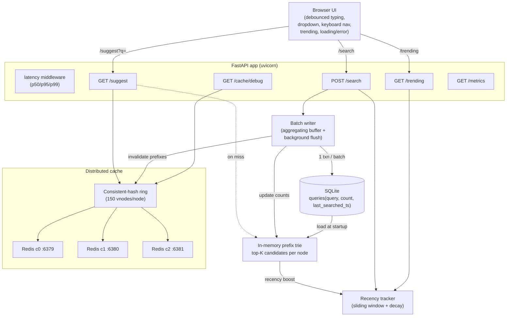

# High-Level Design — Search Typeahead System

## 1. Goal

Suggest popular search queries as the user types, with **low-latency reads**, while keeping
query-popularity data up to date under **write pressure**. Reads (suggestions) dominate writes
(searches), so the design optimizes the read path hard (in-memory index + distributed cache) and
relaxes the write path (asynchronous batched writes).

## 2. Component architecture

## 3. Request flows

**Suggest (read, hot path):**
1. Normalize the prefix (trim + lowercase).
2. Consistent-hash ring maps the prefix → one Redis node. `GET` the cached top-10.
3. **Hit** → return. **Miss** → walk the trie to the prefix node, read its top-K candidates,
   rank them (basic = by count, enhanced = count + recency boost), `SETEX` the result with a TTL,
   return.

**Search (write, cold path):**
1. Return `{"message": "Searched"}` immediately.
2. Record the query in the recency tracker (so trending updates right away).
3. Add `+1` to the batch buffer (aggregating repeats). The DB is **not** touched synchronously.
4. A background loop flushes the buffer to SQLite in one transaction, updates the trie counts,
   and invalidates the affected cache prefixes.

## 4. Data model

`queries(query TEXT PRIMARY KEY, count INTEGER, last_searched_ts REAL)` in SQLite is the source of
truth. The in-memory **prefix trie** is a derived read-optimized view rebuilt from it at startup
and kept in sync by the batch writer. Recency lives only in memory (a sliding window of buckets).

## 5. Mapping to the System Design 101 syllabus

| Syllabus topic | Where it appears | File |
|---|---|---|
| HTTP APIs / API design / microservices | REST endpoints; services split by responsibility (suggest/search/trending/batch) — each could become its own microservice; HTTP now, gRPC/RPC if we split for latency | `backend/main.py`, `backend/services/*` |
| Load balancing & **consistent hashing** | Hash ring with virtual nodes routes prefix keys to Redis nodes; a real deployment puts an LB in front of stateless API replicas | `backend/cache/ring.py` |
| Caching hierarchy; local vs global; single vs **distributed** | Browser debounce (edge), 3-node distributed Redis cache (backend), CDN for static assets (future) | `backend/cache/cache.py`, `frontend/app.js` |
| Eviction & **invalidation**; immediate vs eventual consistency | TTL eviction + LRU `maxmemory` on Redis; explicit prefix invalidation on rank change; batching makes counts **eventually** consistent | `cache.py`, `docker-compose.yml`, `batch_writer.py` |
| CAP / PACELC; **replication vs sharding** | Cache is AP/eventually-consistent (favor availability + latency); to scale the store we shard by `query` and add read replicas | §6 below |
| Master–slave; tunable consistency | Suggestion reads could hit replicas; writes go to the master; batching is a deliberate consistency relaxation for throughput | §6 below |
| SQL vs NoSQL + **sharding key** | SQL/SQLite chosen for ACID + simplicity at demo scale; natural sharding key is `query` (or prefix); when writes dominate, NoSQL wins | §6 below |
| NoSQL internals: **LSM tree, sparse index, bloom filter** | Our buffer→flush is conceptually an LSM memtable→SSTable flush; a bloom filter would let us skip lookups for non-existent queries | §6 below |

## 6. Scaling & trade-offs (how the demo would grow to production)

- **Stateless API + LB:** the FastAPI app holds only derived state (trie, recency), so we can run
  many replicas behind a load balancer (round-robin / least-connections). The trie can be rebuilt
  on each replica from the store or served by a dedicated suggestion service.
- **Sharding the store:** at high volume, shard `queries` by a hash of `query`. Sharding by
  `query` keeps each query's count on one shard (no cross-shard counter merges). The downside
  (per the syllabus): cross-query analytics and global "top N" need scatter-gather.
- **Replication / master–slave:** reads (the majority) fan out to read replicas; the master takes
  the batched writes. This is exactly the "read-heavy → replicate" pattern.
- **CAP / PACELC:** the cache and counts favor **A**vailability and low **L**atency over strict
  **C**onsistency — a suggestion that is a few seconds stale is fine. That is an explicit PACELC
  "else latency" choice.
- **NoSQL / LSM option:** counts are a write-heavy, append-like workload — a natural fit for an
  LSM-tree store (Cassandra/RocksDB). Our in-memory buffer that flushes in bulk mirrors an LSM
  **memtable** flushing to an **SSTable**; a **bloom filter** per segment would let reads skip
  segments that cannot contain a query (e.g. a brand-new prefix), and a **sparse index** would
  locate keys within a segment without indexing every row.

## 7. Key design decisions (one line each)

- **Trie + per-node top-K:** prefix lookups in `O(len(prefix))`, ranking candidates precomputed.
- **Candidate generation + re-rank:** trie returns top-50 by count; recency re-ranks within that
  pool — cheap static candidates, dynamic final score.
- **Monotonic counts:** counts only increase, which makes both the trie build (no sorting) and
  runtime updates (promote-along-path, copy-on-write) correct and cheap.
- **Consistent hashing over modulo:** adding/removing a cache node remaps ~1/N keys, not all.
- **TTL + targeted invalidation:** freshness without a global cache flush.
- **Batched async writes:** collapse N searches into few transactions; bounded data-loss window.

See [API.md](API.md) for the API contract and [PERFORMANCE.md](PERFORMANCE.md) for measurements.
